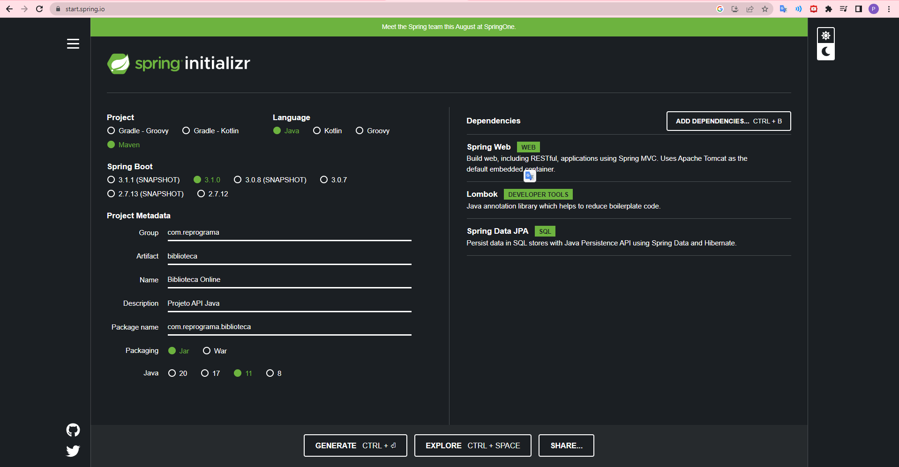
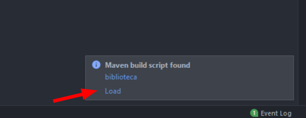
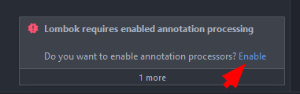

# Planejamento de Aula

## Conceitos(1h)
- O que é API?
    - Apresentar o conceito de API 
    - Usar analogia para exemplificar
  
- Verbos HTTP
      - HTTP: Hypertext Transfer Protocol
      - Conceitualizar verbos HTTP e informar os principais utilizados
      - Conceitualizar os métodos POST e GET
      - Apresentar sites que utilizam das requisições do tipo GET e POST

## Instalação de ferramentas(45min)
- Apresentação da IDE IntelliJ Community. Caso algum aluno tenha tido problemas em baixar a ferramenta pedir que instale o Eclipse
- Apresentação Insomnia. Caso algum aluno tenha tido problemas em baixar a ferramenta pedir que instale o Postman

## Atividades/Desafios (1h)
- (Obrigatório) Contruir junto com a turma método POST para salvar livros

- (Obrigatório) Contruir junto com a turma método GET para listar todos os livros 

- (Opcional: Pós-aula) Construir método para criar categorias

- (Opcional: Pós-aula) Construir método buscar categorias por id

## Dúvidas (15min)
- Tempo reservado para dúvidas gerais da turma

----
## Roteiro

### Apresentação Slides
- Apresentação do conteúdo, considerando todos como iniciantes para que na construção dos exercícios e desafios todos estejam no nível de conhecimento que permita entender o que está sendo construído.
- Tirar dúvidas nos momentos de dúvidas e quando os alunos levantarem as dúvidas sobre os conteúdos.

### Instalação de ferramentas
- Perguntar se todos instalaram:
  - o IntelliJ, caso não tenham conseguido pedir que acesse o site https://www.jetbrains.com/idea/download/#section=windows, caso o problema persista pedir que baixe o https://www.eclipse.org/downloads/
  - o JDK 11, caso algum aluno não tenha conseguido instalar o pacote seguir o tutorial junto com a turma. https://www.ic.unicamp.br/~ra100621/class/2020.1/LPOO_files/curso/prologo/00-instalacao/windows/00-tuto_instal_windows.html
  - o Insomnia, caso algum aluno não tenha conseguido instalar, seguir com a instalação do Postman
- Apresentar a tela:
  - Abrir o site: https://spring.io/ e pedir que as configurações abaixo sejam seguidas.
     - clicar no botão Generate seja clicado
    
     - dezipar o arquivo gerado
  - abrir o projeto no IntelliJ
    - carregar o maven
    
    
    - aguardar carregamento
    - clicar em Enabled Lombok
    
    
    - criar packages controller e model
    - seguir o passo a passo do arquivos, após criar as classes: CategoriaDTO, LivroDTO
    - criar o controller LivroController e seguir o passo a passo
    - propor o desafio para CategoriaController. Dar o tempo a turma e propor a solução caso dê tempo, caso contrário propor a turma o depara com o projeto e estar aberta a dúvidas fora da aula.

### Atividades/Desafios
- Seguir passo a passo dos todos das classes.